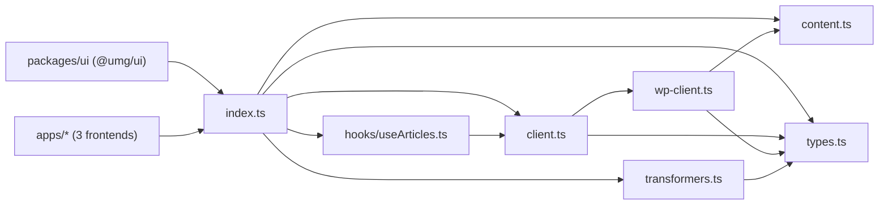

# packages/api — overview

`@umg/api` is the shared data layer for all three Next.js frontends. It abstracts two WordPress backends behind one normalized article API: the custom **United Media Ingestor** endpoint (`um/v1/articles`, UMG) and the standard WP REST API (`wp/v2/*`, Echo Media / International Spectrum), selected at runtime via `NEXT_PUBLIC_API_MODE`. It also provides content sanitization (Divi shortcode stripping), UI-shape transformers, and a React fetch hook.

## Contents
| Item | Type | Summary |
|------|------|---------|
| [index.ts](index.ts.md) | file | Barrel — public entry point of `@umg/api`. |
| [client.ts](client.ts.md) | file | Mode-switching facade: `fetchArticles`, `searchArticles`, `fetchArticleBySlug`, `fetchAllSlugs`, `fetchComments`, `postComment`; URL normalization for UMG custom mode. |
| [wp-client.ts](wp-client.ts.md) | file | Standard WP REST implementations (`wp/v2/posts`, `categories`, `media`, `comments`) adapting `WpPost` → `ApiArticle`. |
| [content.ts](content.ts.md) | file | Divi shortcode / Gutenberg image-block stripping, image URL + gallery ID extraction. |
| [transformers.ts](transformers.ts.md) | file | `ApiArticle[]` → per-section UI shapes (`SectionData`, `SectionType4Data`); `NEXT_PUBLIC_ARTICLE_META` handling. |
| [types.ts](types.ts.md) | file | All shared types: `ApiArticle`, `ArticlesResponse`, `WpPost`, `WpComment`, section data shapes. |
| [hooks/](hooks/README.md) | folder | React hooks (`useArticles`). |
| [package.json](package.json.md) | file | `@umg/api` manifest — no runtime deps, React as peer. |
| [tsconfig.json](tsconfig.json.md) | file | Standalone strict/noEmit TS config. |

## Connections

## Entry points
- The barrel [index.ts](index.ts.md) is the only public surface (`@umg/api`). Apps and `@umg/ui` use the fetch facade, transformers, and `useArticles`; [wp-client.ts](wp-client.ts.md) stays internal behind the facade.
- External connections: `GET {NEXT_PUBLIC_WP_API_URL}/um/v1/articles` in custom mode — served by the United Media Ingestor plugin ([../../plugin/united-media-ingestor/united-media-ingestor.php.md](../../plugin/united-media-ingestor/united-media-ingestor.php.md)) at `api.unitedmediadc.com`; `wp/v2/posts|categories|media|comments` in wp mode at `api.echo-media.info` / `api.internationalspectrum.org`. Full `um/v1` route reference: [rest-api.php](../../plugin/united-media-ingestor/includes/rest-api.php.md).

---
*Documented at commit 1cbdce5.*
