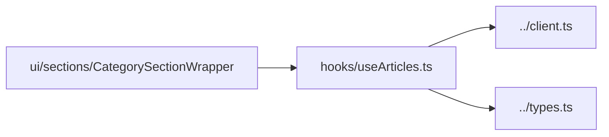

# packages/api/hooks — overview

React hooks for the `@umg/api` package. Currently a single hook that wraps the mode-switching article fetcher with loading/error state for client components.

## Contents
| Item | Type | Summary |
|------|------|---------|
| [useArticles.ts](useArticles.ts.md) | file | `useArticles({ category, count })` — fetch articles for a category with `isLoading` / `error` / `refetch`. |

## Connections

## Entry points
- `useArticles` — re-exported from the package barrel ([../index.ts](../index.ts.md)); consumed by `@umg/ui`'s [CategorySectionWrapper](../../ui/sections/CategorySectionWrapper.tsx.md) to power homepage sections.

---
*Documented at commit 1cbdce5.*
