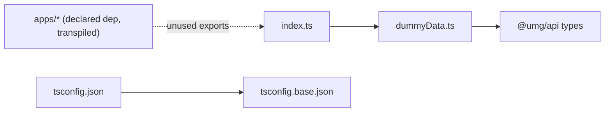

# packages/config — overview

`@umg/config` is a small workspace package holding simulated section data for developing the homepage layouts without a live WordPress backend, plus the monorepo's shared TypeScript base config. Its data exports are currently unused by app code (the apps fetch live data), making it primarily a dev fixture.

## Contents
| Item | Type | Summary |
|------|------|---------|
| [index.ts](index.ts.md) | file | Barrel — re-exports dummyData. |
| [dummyData.ts](dummyData.ts.md) | file | Hardcoded `SectionData` / `SectionType4Data` fixtures (picsum.photos images) for SectionType1–4. |
| [package.json](package.json.md) | file | `@umg/config` manifest — depends on `@umg/api` for types. |
| [tsconfig.base.json](tsconfig.base.json.md) | file | Shared base compiler options (strict, noEmit, bundler resolution). |
| [tsconfig.json](tsconfig.json.md) | file | Extends the base, adds includes. |

## Connections

## Entry points
- [index.ts](index.ts.md) (`@umg/config`) — the five `sectionType*Data` fixtures, type-compatible with what [packages/api/transformers.ts](../api/transformers.ts.md) produces, so any section component in [packages/ui/sections](../ui/sections/README.md) can be rendered statically.
- All three apps declare `@umg/config` and transpile it, but no app currently imports its exports.

---
*Documented at commit 1cbdce5.*
