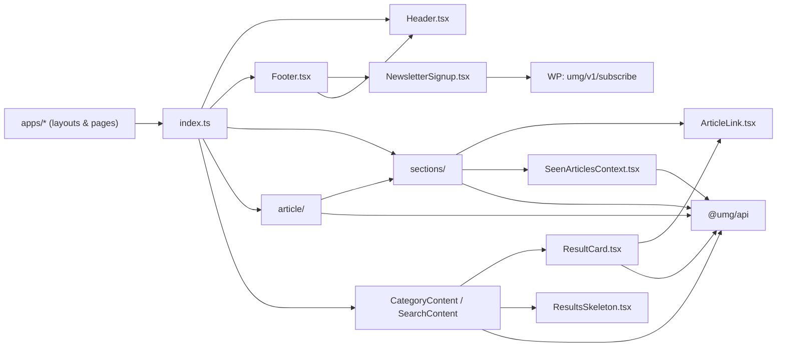

# packages/ui — overview

`@umg/ui` is the shared React component library for all three news frontends (UMG, Echo Media, International Spectrum). It provides the complete page chrome (Header/Footer), the homepage section system, search/category listing pages, the article detail layout, and supporting pieces — all parameterized by props so each app supplies its own branding, categories, and API base. Data flows in through `@umg/api`; styling is Tailwind utility classes compiled by the consuming app.

## Contents
| Item | Type | Summary |
|------|------|---------|
| [index.ts](index.ts.md) | file | Barrel — public surface of `@umg/ui`. |
| [Header.tsx](Header.tsx.md) | file | Sticky header: responsive category nav, search, mobile menu, logo marquee, optional announcement banner. |
| [Footer.tsx](Footer.tsx.md) | file | Footer: logo, optional newsletter signup, company logos, category columns, socials/meta. |
| [NewsletterSignup.tsx](NewsletterSignup.tsx.md) | file | Email form posting to WP `umg/v1/subscribe`. |
| [ArticleLink.tsx](ArticleLink.tsx.md) | file | Internal `/articles/{slug}` link or external new-tab link depending on slug presence. |
| [CategoryContent.tsx](CategoryContent.tsx.md) | file | Paginated category listing page body. |
| [SearchContent.tsx](SearchContent.tsx.md) | file | Search page body driven by `?search=` (Suspense-wrapped). |
| [ResultCard.tsx](ResultCard.tsx.md) | file | List-item card for search/category results. |
| [ResultsSkeleton.tsx](ResultsSkeleton.tsx.md) | file | Loading placeholder for result lists. |
| [NotFoundPage.tsx](NotFoundPage.tsx.md) | file | Shared 404 page body. |
| [SeenArticlesContext.tsx](SeenArticlesContext.tsx.md) | file | Priority-based cross-section article dedup context. |
| [sections/](sections/README.md) | folder | Homepage section system (wrapper + 4 layouts + label/skeleton/error + FeaturedMedia). |
| [article/](article/README.md) | folder | Article detail page (layout, comments, more-articles carousel). |
| [package.json](package.json.md) | file | `@umg/ui` manifest — depends on `@umg/api`; `next`/`react` as peers. |
| [tsconfig.json](tsconfig.json.md) | file | Standalone strict/noEmit TS config. |

## Connections

## Entry points
- Everything goes through the barrel [index.ts](index.ts.md): apps import `Header`, `Footer`, `CategorySectionWrapper` (+ `SeenArticlesProvider`), `CategoryContent`, `SearchContent`, `ArticleLayout`, `NotFoundPage`, and the types `NavCategory`/`BannerCompany`.
- Internal-only modules: [sections/CategoryLabel](sections/CategoryLabel.tsx.md), [article/CommentsSection](article/CommentsSection.tsx.md), [article/MoreArticles](article/MoreArticles.tsx.md).
- External IO: all article/comment data via [@umg/api](../api/README.md); newsletter subscriptions via the umg-newsletter WP plugin ([../../plugin/umg-newsletter/umg-newsletter.php.md](../../plugin/umg-newsletter/umg-newsletter.php.md)).

---
*Documented at commit 1cbdce5.*
