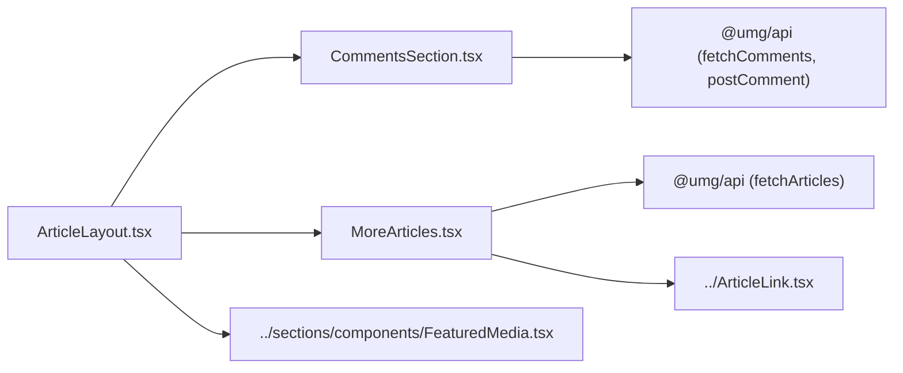

# packages/ui/article — overview

Article detail page components, used by Echo Media and International Spectrum (UMG links externally and has no article pages). ArticleLayout is the public composition; comments and the related-articles carousel mount inside it when their props are provided.

## Contents
| Item | Type | Summary |
|------|------|---------|
| [ArticleLayout.tsx](ArticleLayout.tsx.md) | file | Full article page: meta header, YouTube embed or FeaturedMedia hero, prose body, optional comments + carousel. |
| [CommentsSection.tsx](CommentsSection.tsx.md) | file | WP comments: threaded (2 levels), paginated, anonymous submit with moderation handling. Internal — not in the barrel. |
| [MoreArticles.tsx](MoreArticles.tsx.md) | file | Snap-scroll carousel of 10 interleaved category/recent articles. Internal — not in the barrel. |

## Connections

## Entry points
- `ArticleLayout` (exported from [../index.ts](../index.ts.md)) — consumed by EM/IS `app/articles/[slug]/page.tsx`, which fetch the article server-side via `fetchArticleBySlug` and pass `postId`/`currentSlug` to enable comments/carousel.
- Comments talk to `GET`/`POST /wp/v2/comments` on the per-site WP backend through [packages/api/client.ts](../../api/client.ts.md) (wp mode only).

---
*Documented at commit 1cbdce5.*
