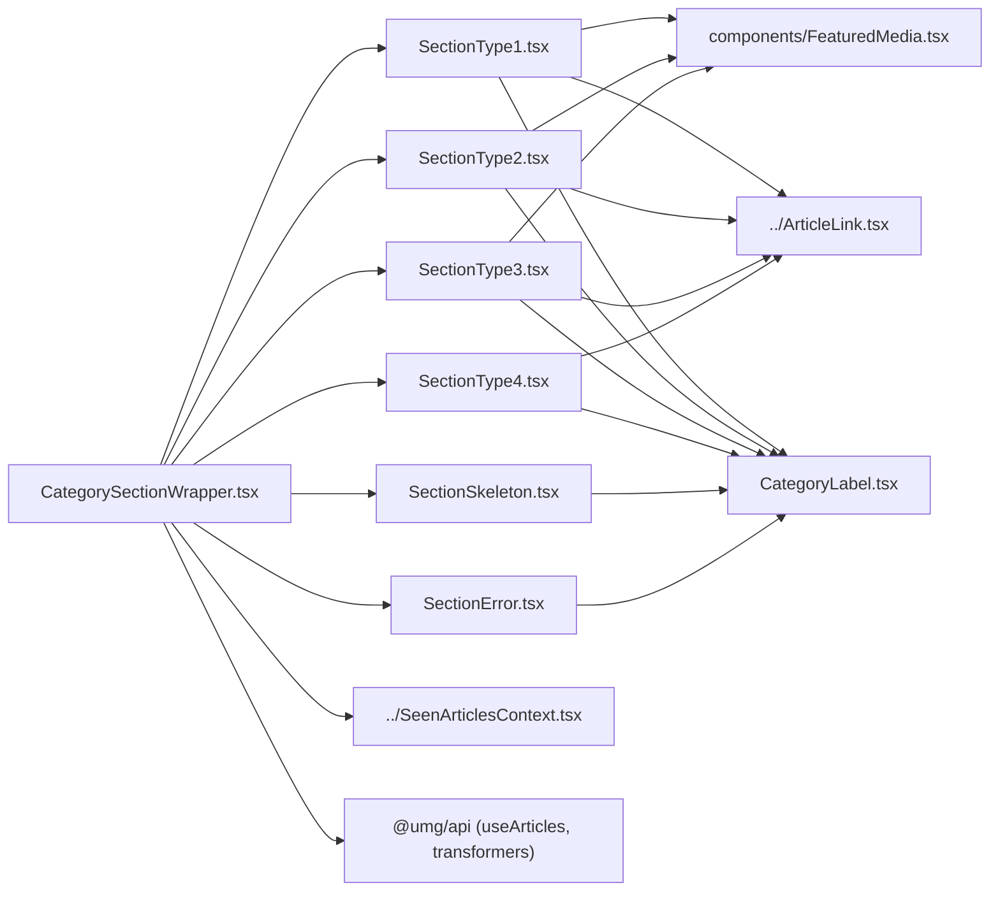

# packages/ui/sections — overview

The homepage section system: four presentational layout variants (featured + secondary article arrangements), their shared category label, loading/error fallbacks, and the smart wrapper that fetches articles, deduplicates them across sections, and picks the layout. Each app's homepage is essentially a stack of `CategorySectionWrapper`s.

## Contents
| Item | Type | Summary |
|------|------|---------|
| [CategorySectionWrapper.tsx](CategorySectionWrapper.tsx.md) | file | Smart orchestrator: `useArticles` fetch → seen-articles dedup → transformer → SectionType1–4 / skeleton / error. |
| [SectionType1.tsx](SectionType1.tsx.md) | file | Hero layout: featured (gallery) + 4 secondary; title auto-fit at 2XL. |
| [SectionType2.tsx](SectionType2.tsx.md) | file | Featured + 4 secondary; 4-col grid at 2XL; title auto-fit at LG+. |
| [SectionType3.tsx](SectionType3.tsx.md) | file | Featured + 3 secondary (type2 variant). |
| [SectionType4.tsx](SectionType4.tsx.md) | file | 4 equal cards, image or text-only variants. |
| [CategoryLabel.tsx](CategoryLabel.tsx.md) | file | Styled/linkable category title (color, underline, icon variants). Internal — not in the barrel. |
| [SectionSkeleton.tsx](SectionSkeleton.tsx.md) | file | Pulsing loading placeholder with live category label. |
| [SectionError.tsx](SectionError.tsx.md) | file | Error/empty fallback with retry button. |
| [components/](components/README.md) | folder | FeaturedMedia gallery/lightbox subcomponent. |

## Connections

## Entry points
- Apps use `CategorySectionWrapper` (with `SectionType`) per homepage category; the section types, skeleton, error, and FeaturedMedia are also individually exported from [../index.ts](../index.ts.md).
- Cross-section dedup requires wrapping the page in [SeenArticlesProvider](../SeenArticlesContext.tsx.md) and passing `priority` props.

---
*Documented at commit 1cbdce5.*
