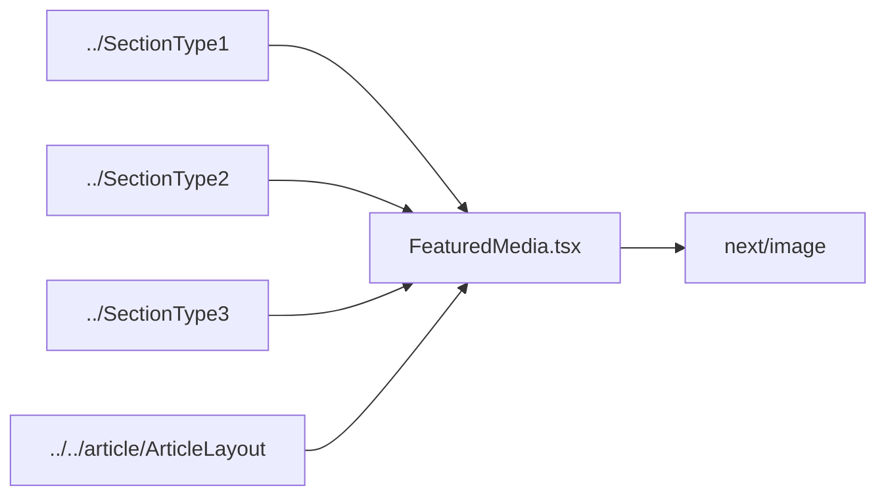

# packages/ui/sections/components — overview

Shared media subcomponent(s) for the section layouts. Currently just FeaturedMedia, which is also reused outside sections by the article page.

## Contents
| Item | Type | Summary |
|------|------|---------|
| [FeaturedMedia.tsx](FeaturedMedia.tsx.md) | file | Single image or gallery carousel with fullscreen lightbox (keyboard nav, portrait detection, loading spinners). |

## Connections

## Entry points
- `FeaturedMedia` — exported from the package barrel ([../../index.ts](../../index.ts.md)); used as the hero media block in SectionType1–3 and [ArticleLayout](../../article/ArticleLayout.tsx.md).

---
*Documented at commit 1cbdce5.*
