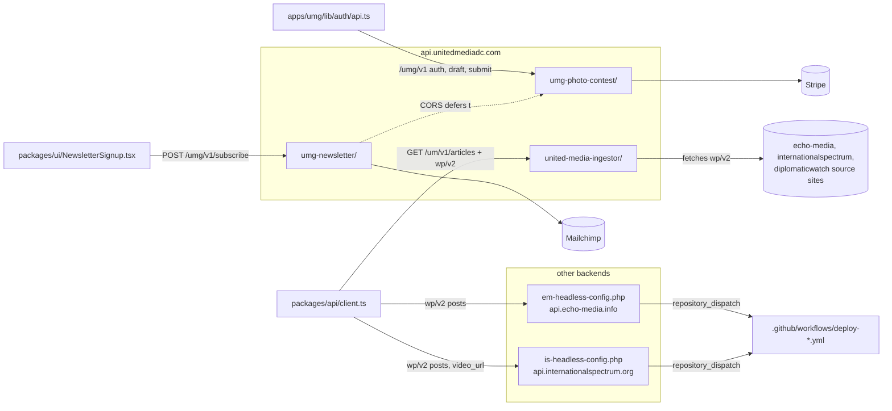

# plugin — overview

WordPress plugin **source code** that lives (unusually) under `docs/plugin/` in this repo and is deployed to the headless WordPress backends — it is not part of the Next.js build. Three full plugins run on api.unitedmediadc.com (UMG), and two standalone single-file config plugins run on the Echo Media and International Spectrum backends. Together they provide every custom REST route the frontends call, plus CORS/caching/redirect config and auto-rebuild webhooks.

## Contents
| Item | Type | Summary |
|------|------|---------|
| [united-media-ingestor/](united-media-ingestor/README.md) | folder | Article aggregator for UMG: ingests three source sites into a local `um_article` store, serves `GET /um/v1/articles`; also embeds UMG's headless config |
| [umg-photo-contest/](umg-photo-contest/README.md) | folder | Photo competition backend: email-code auth + JWT, Stripe payment webhook, draft/photo uploads, submission (`/umg/v1/*`) |
| [umg-newsletter/](umg-newsletter/README.md) | folder | Mailchimp subscribe proxy: `POST /umg/v1/subscribe` (double opt-in, rate-limited) |
| [em-headless-config.php](em-headless-config.php.md) | file | Echo Media backend config: CORS, REST no-cache, 301 front-end redirect, GitHub `deploy-echo-media` dispatch on post changes |
| [is-headless-config.php](is-headless-config.php.md) | file | International Spectrum backend config: CORS, no-cache, `deploy-international-spectrum` dispatch, `video_url` meta + `author_display_name` REST field (redirect currently disabled) |

Non-mirrored source docs in this folder: `headless-config-plugins.md` (install guide), `umg-photo-contest.md` / `umg-newsletter.md` (older plugin docs — the per-file docs here are more current), `united-media-ingestor/QUICK-START.md` (backfill operator guide).

## Connections

## Entry points
- **Plugin bootstraps:** [united-media-ingestor/united-media-ingestor.php](united-media-ingestor/united-media-ingestor.php.md), [umg-photo-contest/umg-photo-contest.php](umg-photo-contest/umg-photo-contest.php.md), [umg-newsletter/umg-newsletter.php](umg-newsletter/umg-newsletter.php.md); the two `*-headless-config.php` files are self-contained plugins.
- **Full custom REST surface:**
  - `um/v1`: `GET /articles` (public — aggregated article feed).
  - `umg/v1`: `POST /subscribe` (public, rate-limited); `POST /auth/request-code`, `POST /auth/verify-code` (public); `POST /stripe-webhook` (Stripe-signature); `GET /me`, `GET /payment-status`, `GET /draft`, `PUT /draft`, `POST /draft/photo`, `DELETE /draft/photo/{id}`, `POST /draft/student-proof`, `DELETE /draft/student-proof`, `POST /submit` (Bearer JWT).
  - The frontends also use core `wp/v2` on each backend (posts, categories, media), augmented on IS by `video_url` meta and `author_display_name`.
- **Cron hooks:** ingestor `um_cron_incremental` (5 min), `um_cron_backfill` (15 min), `um_cron_server_backfill` (1 min while active); photo contest `umgpc_cleanup_orphaned_drafts` (weekly).
- **Webhooks in:** Stripe → `/wp-json/umg/v1/stripe-webhook`. **Webhooks out:** EM/IS post changes → GitHub `repository_dispatch` consumed by [.github/workflows/](../.github/workflows/README.md).
- **Deployment:** files are uploaded to each backend's `wp-content/plugins/` (see `docs/plugin/headless-config-plugins.md`); secrets (`GH_REBUILD_TOKEN`, Mailchimp keys, `UMGPC_STRIPE_WEBHOOK_SECRET`, `UMGPC_JWT_SECRET`) live in each site's `wp-config.php`, never in this repo.

---
*Documented at commit 1cbdce5.*
