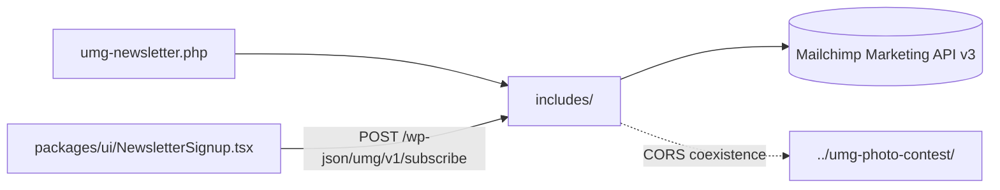

# umg-newsletter — overview

Thin WordPress plugin on api.unitedmediadc.com that proxies newsletter signups to Mailchimp server-side (the API key never reaches the browser). One public REST route, double opt-in, per-IP rate limiting.

## Contents
| Item | Type | Summary |
|------|------|---------|
| [umg-newsletter.php](umg-newsletter.php.md) | file | Bootstrap: defines `UMG_NL_PATH`, requires the three includes; no activation hooks |
| [includes/](includes/README.md) | folder | Mailchimp config, CORS (coexisting with the photo contest plugin), subscribe endpoint |

## Connections

## Entry points
- **Plugin bootstrap:** [umg-newsletter.php](umg-newsletter.php.md).
- **Public REST:** `POST /wp-json/umg/v1/subscribe` — public, rate-limited 5/IP/hour; double opt-in (`status: pending`), tags `website-signup` + `umg-main`. Consumed by the shared Footer's newsletter form when a site passes `apiBaseUrl` (currently the UMG app).
- Shares the `umg/v1` namespace with [../umg-photo-contest/](../umg-photo-contest/README.md); its CORS handler stands down when the photo contest plugin is active.
- Requires `MAILCHIMP_API_KEY`, `MAILCHIMP_LIST_ID`, `MAILCHIMP_SERVER_PREFIX` in `wp-config.php` (returns 500 `not_configured` otherwise).

---
*Documented at commit 1cbdce5.*
