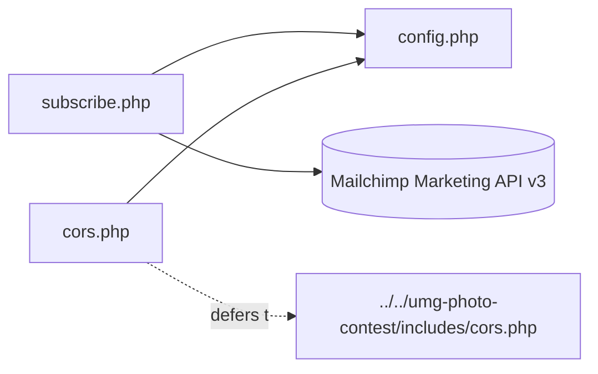

# umg-newsletter/includes — overview

The three include files of the newsletter plugin: Mailchimp configuration, CORS handling that coexists with the photo contest plugin, and the single subscribe REST endpoint.

## Contents
| Item | Type | Summary |
|------|------|---------|
| [config.php](config.php.md) | file | Mailchimp constants (`MAILCHIMP_API_KEY`/`LIST_ID`/`SERVER_PREFIX`), rate limit (5/IP/hour), allowed CORS origins |
| [cors.php](cors.php.md) | file | OPTIONS preflight for `/umg/v1/subscribe`; response CORS only when the photo contest plugin isn't already handling the namespace |
| [subscribe.php](subscribe.php.md) | file | `POST /wp-json/umg/v1/subscribe` — validates, rate-limits, double-opt-in subscribe to Mailchimp, tags new members |

## Connections

## Entry points
- Loaded by [../umg-newsletter.php](../umg-newsletter.php.md) in order config → cors → subscribe.
- Public REST: `POST /wp-json/umg/v1/subscribe` (public, rate-limited) — called by the shared newsletter form ([packages/ui/NewsletterSignup.tsx](../../../packages/ui/NewsletterSignup.tsx.md)).
- No cron, no CPTs, no admin UI.

---
*Documented at commit 1cbdce5.*
