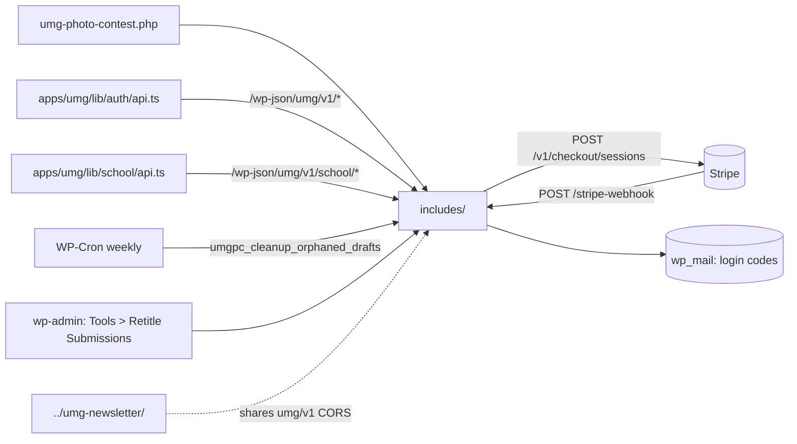

# umg-photo-contest — overview

WordPress plugin on api.unitedmediadc.com backing the UMG photography competition: passwordless email-code login with custom JWTs, Stripe entry-fee tracking via webhook (individual flow and school-batch flow), draft entries with photo/proof uploads stored as a non-public CPT, final submission, school/bulk-registration CRUD with a combined Stripe checkout for multiple applications per account, a wp-admin bulk-retitle tool, and weekly draft cleanup. The frontend (apps/umg) drives everything through `/wp-json/umg/v1/*`.

## Contents
| Item | Type | Summary |
|------|------|---------|
| [umg-photo-contest.php](umg-photo-contest.php.md) | file | Bootstrap: loads the eleven includes, activation (CPT + weekly cleanup cron), deactivation cleanup |
| [includes/](includes/README.md) | folder | Config, CORS, CPT, JWT, auth, payment, draft, submission, school, admin-tools, cleanup |

## Connections

## Entry points
- **Plugin bootstrap:** [umg-photo-contest.php](umg-photo-contest.php.md).
- **REST (namespace `umg/v1`):**
  - Public: `POST /auth/request-code`, `POST /auth/verify-code`; `POST /stripe-webhook` (Stripe-Signature verified, handles both the individual and school-batch flows).
  - Bearer JWT, individual flow: `GET /me`, `GET /payment-status`, `GET /draft`, `PUT /draft`, `POST /draft/photo`, `DELETE /draft/photo/{id}`, `POST /draft/student-proof`, `DELETE /draft/student-proof`, `POST /draft/retitle`, `POST /submit`.
  - Bearer JWT, school/bulk registration — **feature complete, live-verified with a real payment**: `GET/POST /school/applications`, `GET/PUT/DELETE /school/application/{id}`, `POST /school/application/{id}/photo`, `DELETE /school/application/{id}/photo/{mediaId}`, `POST /school/application/{id}/submit`, `POST /school/application/{id}/retitle`, `POST /school/checkout` (creates one Stripe Checkout Session covering the caller's whole submitted-unpaid batch).
- **wp-admin (not REST):** Tools → Retitle Submissions, gated by `manage_options` — bulk-fixes submission titles site-wide, a job no REST endpoint can safely do (this plugin's JWT auth only ever grants subscriber-level access).
- **Cron:** `umgpc_cleanup_orphaned_drafts` (weekly).
- **Frontend consumers:** [apps/umg/lib/auth/api.ts](../../apps/umg/lib/auth/api.ts.md) + [apps/umg/lib/auth/AuthContext.tsx](../../apps/umg/lib/auth/AuthContext.tsx.md) (individual flow, submission form at [apps/umg/app/photo-submission/components/SubmissionForm.tsx](../../apps/umg/app/photo-submission/components/SubmissionForm.tsx.md)); [apps/umg/lib/school/api.ts](../../apps/umg/lib/school/api.ts.md) + [apps/umg/app/school-registration/](../../apps/umg/app/school-registration/README.md) (school flow). The individual flow's Stripe Payment Link lives in the frontend competition config (`apps/umg/lib/competitions/current.ts`); the school flow's Checkout Session is created dynamically server-side, not a static link.
- Config via `wp-config.php` constants: `UMGPC_JWT_SECRET` (falls back to `AUTH_KEY`), `UMGPC_STRIPE_WEBHOOK_SECRET` (required for both payment flows' webhook), `UMGPC_STRIPE_SECRET_KEY` (required for the school flow's checkout creation only — a **restricted** key, Checkout Sessions: write only). Entries are reviewed in wp-admin ("Photo Contest" menu) — there is no REST read path for submissions (individual or school) beyond each account's own data.

## Notes
- The school/bulk-registration feature (added 2026-07-03) was built, deployed, and live-verified end to end against production, including a real Stripe payment crediting two applications from one checkout — see `claude-context/current-work/bulk-registration/` (plan, chat log, client questions, and a commit-by-commit implementation checklist with every test performed).

---
*Documented at commit e5821d4.*
