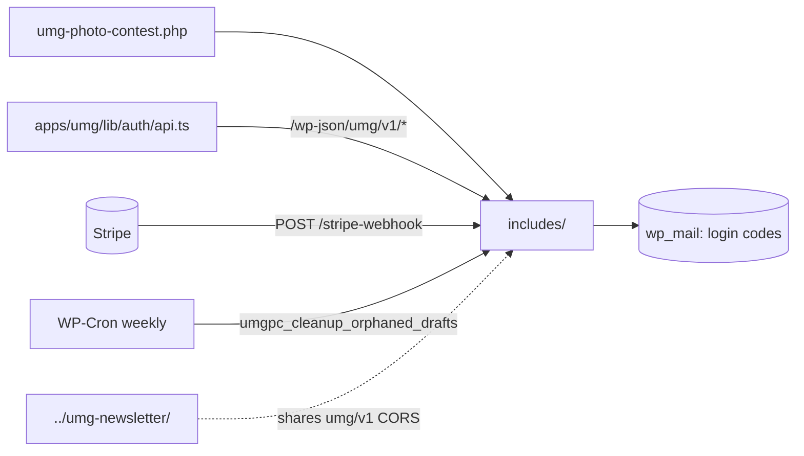

# umg-photo-contest — overview

WordPress plugin on api.unitedmediadc.com backing the UMG photography competition: passwordless email-code login with custom JWTs, Stripe entry-fee tracking via webhook, draft entries with photo/proof uploads stored as a non-public CPT, final submission, school/bulk-registration CRUD for multiple applications per account, and weekly draft cleanup. The frontend (apps/umg) drives everything through `/wp-json/umg/v1/*`.

## Contents
| Item | Type | Summary |
|------|------|---------|
| [umg-photo-contest.php](umg-photo-contest.php.md) | file | Bootstrap: loads the ten includes, activation (CPT + weekly cleanup cron), deactivation cleanup |
| [includes/](includes/README.md) | folder | Config, CORS, CPT, JWT, auth, payment, draft, submission, school, cleanup |

## Connections

## Entry points
- **Plugin bootstrap:** [umg-photo-contest.php](umg-photo-contest.php.md).
- **REST (namespace `umg/v1`):**
  - Public: `POST /auth/request-code`, `POST /auth/verify-code`; `POST /stripe-webhook` (Stripe-Signature verified).
  - Bearer JWT: `GET /me`, `GET /payment-status`, `GET /draft`, `PUT /draft`, `POST /draft/photo`, `DELETE /draft/photo/{id}`, `POST /draft/student-proof`, `DELETE /draft/student-proof`, `POST /submit`.
  - Bearer JWT, school/bulk registration (day-one stopgap, backend-only so far): `GET/POST /school/applications`, `GET/PUT/DELETE /school/application/{id}`, `POST /school/application/{id}/photo`, `DELETE /school/application/{id}/photo/{mediaId}`, `POST /school/application/{id}/submit`.
- **Cron:** `umgpc_cleanup_orphaned_drafts` (weekly).
- **Frontend consumers:** [apps/umg/lib/auth/api.ts](../../apps/umg/lib/auth/api.ts.md) + [apps/umg/lib/auth/AuthContext.tsx](../../apps/umg/lib/auth/AuthContext.tsx.md), submission form at [apps/umg/app/photo-submission/components/SubmissionForm.tsx](../../apps/umg/app/photo-submission/components/SubmissionForm.tsx.md). Stripe Payment Link lives in the frontend competition config (`apps/umg/lib/competitions/current.ts`). School routes have no frontend consumer yet — see `claude-context/current-work/bulk-registration/implementation-checklist.md`.
- Config via `wp-config.php` constants: `UMGPC_JWT_SECRET` (falls back to `AUTH_KEY`), `UMGPC_STRIPE_WEBHOOK_SECRET` (required for payments). Entries are reviewed in wp-admin ("Photo Contest" menu) — there is no REST read path for submissions (individual or school).

---
*Documented at commit 62e1c78.*
