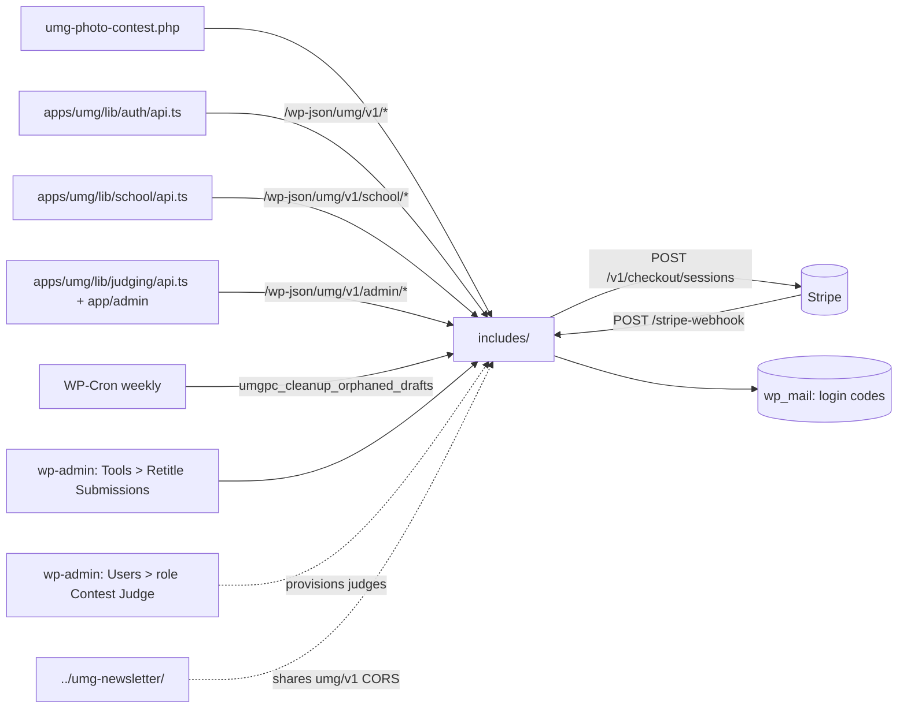

# umg-photo-contest — overview

WordPress plugin on api.unitedmediadc.com backing the UMG photography competition: passwordless email-code login with custom JWTs, Stripe entry-fee tracking via webhook (individual flow and school-batch flow), draft entries with photo/proof uploads stored as a non-public CPT, submit/un-submit (entries editable until paid, final after), school/bulk-registration CRUD with a combined Stripe checkout for multiple applications per account, a capability-gated judge panel API (blind judging, per-judge scores, admin-only aggregated results), a wp-admin bulk-retitle tool, and weekly draft cleanup. The frontend (apps/umg) drives everything through `/wp-json/umg/v1/*`.

## Contents
| Item | Type | Summary |
|------|------|---------|
| [umg-photo-contest.php](umg-photo-contest.php.md) | file | Bootstrap: loads the fourteen includes, activation (CPT + weekly cleanup cron), deactivation cleanup |
| [includes/](includes/README.md) | folder | Config, CORS, CPT, entry-state, JWT, roles, auth, payment, draft, submission, judging, school, admin-tools, cleanup |

## Connections

```mermaid
graph LR
  bootstrap[umg-photo-contest.php] --> includes[includes/]
  frontend[apps/umg/lib/auth/api.ts] -->|/wp-json/umg/v1/*| includes
  frontend2[apps/umg/lib/school/api.ts] -->|/wp-json/umg/v1/school/*| includes
  frontend3[apps/umg/lib/judging/api.ts + app/admin] -->|/wp-json/umg/v1/admin/*| includes
  stripe[(Stripe)] -->|POST /stripe-webhook| includes
  includes -->|POST /v1/checkout/sessions| stripe
  includes --> mail[(wp_mail: login codes)]
  cron[WP-Cron weekly] -->|umgpc_cleanup_orphaned_drafts| includes
  admin[wp-admin: Tools > Retitle Submissions] --> includes
  wpusers[wp-admin: Users > role Contest Judge] -.provisions judges.-> includes
  newsletter[../umg-newsletter/] -.shares umg/v1 CORS.-> includes
```

## Entry points
- **Plugin bootstrap:** [umg-photo-contest.php](umg-photo-contest.php.md).
- **REST (namespace `umg/v1`):**
  - Public: `POST /auth/request-code`, `POST /auth/verify-code`; `POST /stripe-webhook` (Stripe-Signature verified, handles both the individual and school-batch flows).
  - Bearer JWT, individual flow: `GET /me`, `GET /payment-status`, `GET /draft`, `PUT /draft`, `POST /draft/photo`, `DELETE /draft/photo/{id}`, `POST /draft/student-proof`, `DELETE /draft/student-proof`, `POST /draft/retitle`, `POST /submit`, `POST /unsubmit` (revert to draft for edits; 403 once paid).
  - Bearer JWT, school/bulk registration — **feature complete, live-verified with a real payment**: `GET/POST /school/applications`, `GET/PUT/DELETE /school/application/{id}`, `POST /school/application/{id}/photo`, `DELETE /school/application/{id}/photo/{mediaId}`, `POST /school/application/{id}/submit`, `POST /school/application/{id}/unsubmit`, `POST /school/application/{id}/retitle`, `POST /school/checkout` (creates one Stripe Checkout Session covering the caller's whole submitted-unpaid batch).
  - Bearer JWT **plus WP capability**, judge panel (v1 shipped 2026-07-04, parked for client feedback): `GET /admin/submissions`, `GET /admin/submissions/{id}`, `PUT /admin/submissions/{id}/score` (`umgpc_judge_submissions` — judges + admins), `GET /admin/results` (`umgpc_admin_results` — admins only). Blind judging (identity hidden from judges) is on by default via the `umgpc_blind_judging` option. Judges log in through the normal email-code flow; what makes them a judge is the "Contest Judge" role assigned in wp-admin ([includes/roles.php](includes/roles.php.md)).
- **wp-admin (not REST):** Tools → Retitle Submissions, gated by `manage_options` — bulk-fixes submission titles site-wide, a job no REST endpoint can safely do (this plugin's JWT auth only ever grants subscriber-level access).
- **Cron:** `umgpc_cleanup_orphaned_drafts` (weekly).
- **Frontend consumers:** [apps/umg/lib/auth/api.ts](../../apps/umg/lib/auth/api.ts.md) + [apps/umg/lib/auth/AuthContext.tsx](../../apps/umg/lib/auth/AuthContext.tsx.md) (individual flow, submission form at [apps/umg/app/photo-submission/components/SubmissionForm.tsx](../../apps/umg/app/photo-submission/components/SubmissionForm.tsx.md)); [apps/umg/lib/school/api.ts](../../apps/umg/lib/school/api.ts.md) + [apps/umg/app/school-registration/](../../apps/umg/app/school-registration/README.md) (school flow); `apps/umg/lib/judging/api.ts` + `apps/umg/app/admin/` (judge panel — frontend not yet mirrored in docs at this commit). The individual flow's Stripe Payment Link lives in the frontend competition config (`apps/umg/lib/competitions/current.ts`); the school flow's Checkout Session is created dynamically server-side, not a static link.
- Config via `wp-config.php` constants: `UMGPC_JWT_SECRET` (falls back to `AUTH_KEY`), `UMGPC_STRIPE_WEBHOOK_SECRET` (required for both payment flows' webhook), `UMGPC_STRIPE_SECRET_KEY` (required for the school flow's checkout creation only — a **restricted** key, Checkout Sessions: write only). Entries can be reviewed in wp-admin ("Photo Contest" menu); the only REST read path to *other* accounts' entries is the capability-gated judge panel API in [includes/judging.php](includes/judging.php.md) (submitted entries only). One runtime WP option: `umgpc_blind_judging`.

## Notes
- **Entry state machine** ([includes/entry-state.php](includes/entry-state.php.md)): `draft → submitted` is reversible via un-submit until the entry is paid, after which it is final. The paid check is payment-model-agnostic (school: post meta; individual: user meta) — but note the unverified `post_author` caveat documented there, which may make the individual-flow half of that guard ineffective.
- The school/bulk-registration feature (added 2026-07-03) was built, deployed, and live-verified end to end against production, including a real Stripe payment crediting two applications from one checkout — see `claude-context/finished-work/bulk-registration/` (plan, chat log, client questions, and a commit-by-commit implementation checklist with every test performed).

---
*Documented at commit bde729d.*
