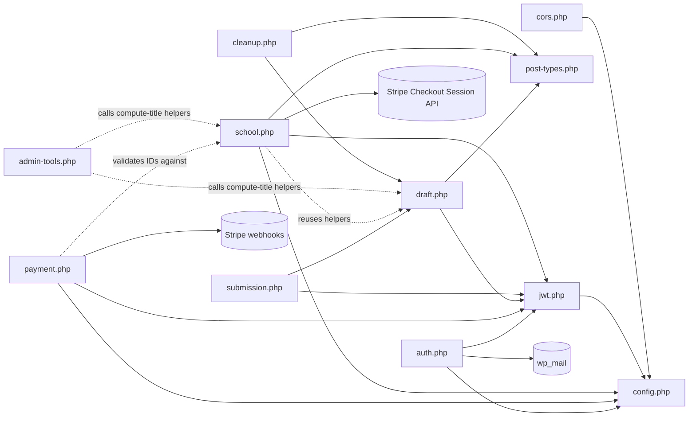

# umg-photo-contest/includes — overview

The eleven include files of the photo competition plugin: constants/CORS, the `umg_submission` CPT, a dependency-free HS256 JWT layer, passwordless email-code auth, Stripe payment tracking (individual + school-batch), draft CRUD with media uploads, final submission, school/bulk-registration CRUD with a combined Stripe checkout, a wp-admin-only bulk retitle tool, and a weekly cleanup cron.

## Contents
| Item | Type | Summary |
|------|------|---------|
| [config.php](config.php.md) | file | JWT secret/expiry, auth-code expiry, Stripe webhook secret + API secret key, allowed CORS origins |
| [cors.php](cors.php.md) | file | OPTIONS preflight + origin-whitelisted CORS for the whole `umg/v1` namespace; REST no-cache headers |
| [post-types.php](post-types.php.md) | file | Non-public `umg_submission` CPT (wp-admin "Photo Contest" menu) used as the data store; cascade-deletes a submission's photos when the post is permanently deleted |
| [jwt.php](jwt.php.md) | file | HS256 generate/validate + `umgpc_get_user_from_request()` — the auth guard for every protected route |
| [auth.php](auth.php.md) | file | `POST /auth/request-code`, `POST /auth/verify-code`, `GET /me` — email-code login, implicit user creation, JWT minting |
| [payment.php](payment.php.md) | file | `GET /payment-status` (JWT) and `POST /stripe-webhook` (signature-verified) — marks individual-flow users paid, or credits every application in a school batch from one event |
| [draft.php](draft.php.md) | file | Draft CRUD: `GET/PUT /draft`, photo upload/delete (max 3 JPEGs), student-proof upload/delete, wp-admin title upkeep |
| [submission.php](submission.php.md) | file | `POST /submit` — flips the draft to `submitted` and timestamps it |
| [school.php](school.php.md) | file | School/bulk-registration CRUD (many independent applications per account) plus `POST /school/checkout` — one Stripe Checkout Session covering the whole submitted-unpaid batch |
| [admin-tools.php](admin-tools.php.md) | file | wp-admin Tools page (not a REST endpoint) that bulk-retitles every submission site-wide, gated by real `manage_options` capability |
| [cleanup.php](cleanup.php.md) | file | Weekly cron deleting 90-day-stale never-submitted drafts and their photos |

## Connections

## Entry points
- Loaded by [../umg-photo-contest.php](../umg-photo-contest.php.md) in order: config → cors → post-types → jwt → auth → payment → draft → submission → school → admin-tools → cleanup.
- REST routes (namespace `umg/v1`): public `POST /auth/request-code`, `POST /auth/verify-code`, `POST /stripe-webhook` (Stripe signature); Bearer-JWT `GET /me`, `GET /payment-status`, `GET/PUT /draft`, `POST /draft/photo`, `DELETE /draft/photo/{id}`, `POST /draft/student-proof`, `DELETE /draft/student-proof`, `POST /draft/retitle`, `POST /submit`, `GET/POST /school/applications`, `GET/PUT/DELETE /school/application/{id}`, `POST /school/application/{id}/photo`, `DELETE /school/application/{id}/photo/{mediaId}`, `POST /school/application/{id}/submit`, `POST /school/application/{id}/retitle`, `POST /school/checkout`. All consumed by [apps/umg/lib/auth/api.ts](../../../apps/umg/lib/auth/api.ts.md) (individual flow) and [apps/umg/lib/school/api.ts](../../../apps/umg/lib/school/api.ts.md) (school flow).
- wp-admin page (not REST): Tools → Retitle Submissions, gated by `manage_options`.
- Cron hook: `umgpc_cleanup_orphaned_drafts` (weekly, scheduled by the bootstrap's activation hook).

---
*Documented at commit e5821d4.*
