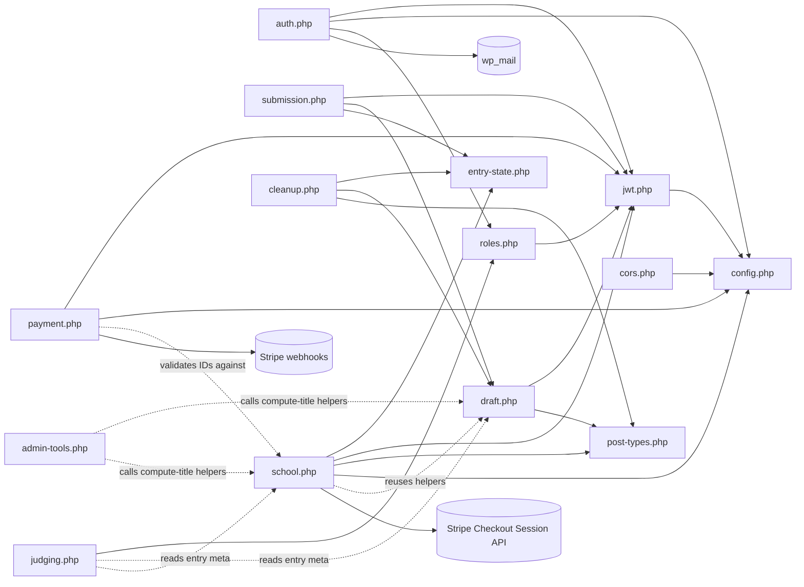

# umg-photo-contest/includes — overview

The fourteen include files of the photo competition plugin: constants/CORS, the `umg_submission` CPT, a shared entry state machine (draft → submitted → paid, reversible until paid), a dependency-free HS256 JWT layer, judge role/capabilities, passwordless email-code auth, Stripe payment tracking (individual + school-batch), draft CRUD with media uploads, submit/un-submit, capability-gated judging endpoints, school/bulk-registration CRUD with a combined Stripe checkout, a wp-admin-only bulk retitle tool, and a weekly cleanup cron.

## Contents
| Item | Type | Summary |
|------|------|---------|
| [config.php](config.php.md) | file | JWT secret/expiry, auth-code expiry, Stripe webhook secret + API secret key, allowed CORS origins |
| [cors.php](cors.php.md) | file | OPTIONS preflight + origin-whitelisted CORS for the whole `umg/v1` namespace; REST no-cache headers |
| [post-types.php](post-types.php.md) | file | Non-public `umg_submission` CPT (wp-admin "Photo Contest" menu) used as the data store; cascade-deletes a submission's photos when the post is permanently deleted |
| [entry-state.php](entry-state.php.md) | file | Shared lifecycle helpers: `umgpc_entry_submit` / `umgpc_entry_unsubmit` (blocked once paid) / `umgpc_entry_is_paid` (payment-model-agnostic) — used by submission, school, cleanup |
| [jwt.php](jwt.php.md) | file | HS256 generate/validate + `umgpc_get_user_from_request()` — the auth guard for every protected route |
| [roles.php](roles.php.md) | file | `umgpc_judge` role + `umgpc_judge_submissions` / `umgpc_admin_results` capabilities (registered on `init`), `umgpc_require_cap()` JWT+capability guard, `umgpc_blind_judging` option |
| [auth.php](auth.php.md) | file | `POST /auth/request-code`, `POST /auth/verify-code`, `GET /me` — email-code login, implicit user creation, JWT minting; responses carry `is_judge`/`is_admin` |
| [payment.php](payment.php.md) | file | `GET /payment-status` (JWT) and `POST /stripe-webhook` (signature-verified) — marks individual-flow users paid, or credits every application in a school batch from one event |
| [draft.php](draft.php.md) | file | Draft CRUD: `GET/PUT /draft`, photo upload/delete (max 3 JPEGs), student-proof upload/delete, wp-admin title upkeep |
| [submission.php](submission.php.md) | file | `POST /submit` and `POST /unsubmit` — individual-flow status transitions, delegating to entry-state.php |
| [judging.php](judging.php.md) | file | Judge panel REST: `GET /admin/submissions`, `GET /admin/submissions/{id}`, `PUT /admin/submissions/{id}/score` (judges), `GET /admin/results` (admins) — blind by default, per-judge JSON scores, criteria-agnostic |
| [school.php](school.php.md) | file | School/bulk-registration CRUD (many independent applications per account), submit/un-submit, plus `POST /school/checkout` — one Stripe Checkout Session covering the whole submitted-unpaid batch |
| [admin-tools.php](admin-tools.php.md) | file | wp-admin Tools page (not a REST endpoint) that bulk-retitles every submission site-wide, gated by real `manage_options` capability |
| [cleanup.php](cleanup.php.md) | file | Weekly cron deleting 90-day-stale never-submitted drafts and their photos; skips paid entries |

## Connections

```mermaid
graph LR
  auth[auth.php] --> jwt[jwt.php]
  auth --> config[config.php]
  payment[payment.php] --> jwt
  payment --> config
  draft[draft.php] --> jwt
  draft --> cpt[post-types.php]
  submission[submission.php] --> jwt
  submission --> draft
  submission --> state[entry-state.php]
  school --> state
  cleanup --> state
  roles[roles.php] --> jwt
  auth --> roles
  judging[judging.php] --> roles
  judging -.reads entry meta.-> draft
  judging -.reads entry meta.-> school
  school[school.php] --> jwt
  school --> cpt
  school --> config
  school -.reuses helpers.-> draft
  payment -.validates IDs against.-> school
  admin[admin-tools.php] -.calls compute-title helpers.-> draft
  admin -.calls compute-title helpers.-> school
  cleanup[cleanup.php] --> draft
  cleanup --> cpt
  jwt --> config
  cors[cors.php] --> config
  payment --> stripe[(Stripe webhooks)]
  school --> stripe2[(Stripe Checkout Session API)]
  auth --> mail[(wp_mail)]
```

## Entry points
- Loaded by [../umg-photo-contest.php](../umg-photo-contest.php.md) in order: config → cors → post-types → entry-state → jwt → roles → auth → payment → draft → submission → judging → school → admin-tools → cleanup.
- REST routes (namespace `umg/v1`): public `POST /auth/request-code`, `POST /auth/verify-code`, `POST /stripe-webhook` (Stripe signature); Bearer-JWT `GET /me`, `GET /payment-status`, `GET/PUT /draft`, `POST /draft/photo`, `DELETE /draft/photo/{id}`, `POST /draft/student-proof`, `DELETE /draft/student-proof`, `POST /draft/retitle`, `POST /submit`, `POST /unsubmit`, `GET/POST /school/applications`, `GET/PUT/DELETE /school/application/{id}`, `POST /school/application/{id}/photo`, `DELETE /school/application/{id}/photo/{mediaId}`, `POST /school/application/{id}/submit`, `POST /school/application/{id}/unsubmit`, `POST /school/application/{id}/retitle`, `POST /school/checkout`; Bearer-JWT **plus capability** (judge panel): `GET /admin/submissions`, `GET /admin/submissions/{id}`, `PUT /admin/submissions/{id}/score` (`umgpc_judge_submissions`), `GET /admin/results` (`umgpc_admin_results`). Consumed by [apps/umg/lib/auth/api.ts](../../../apps/umg/lib/auth/api.ts.md) (individual flow), [apps/umg/lib/school/api.ts](../../../apps/umg/lib/school/api.ts.md) (school flow), and `apps/umg/lib/judging/api.ts` (judge panel — not yet mirrored in docs).
- wp-admin page (not REST): Tools → Retitle Submissions, gated by `manage_options`. Judges are provisioned in wp-admin by assigning the "Contest Judge" role; blind judging is toggled via the `umgpc_blind_judging` option (default on).
- Cron hook: `umgpc_cleanup_orphaned_drafts` (weekly, scheduled by the bootstrap's activation hook).

---
*Documented at commit bde729d.*
