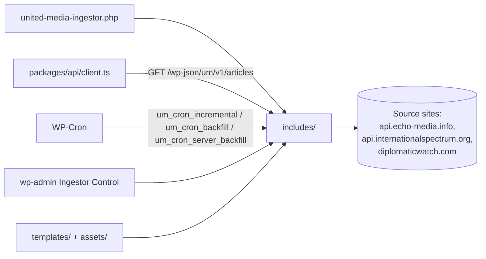

# united-media-ingestor — overview

WordPress plugin (v0.8.x) deployed to api.unitedmediadc.com that aggregates articles from three source WordPress sites (Echo Media, International Spectrum, Diplomatic Watch) into a local `um_article` store with a unified category taxonomy, and serves them to the UMG frontend via `GET /wp-json/um/v1/articles`. It also embeds UMG's headless config (CORS, REST no-cache, front-end 301 redirect), so no separate config plugin is needed for this site.

## Contents
| Item | Type | Summary |
|------|------|---------|
| [united-media-ingestor.php](united-media-ingestor.php.md) | file | Bootstrap: loads the 12 includes, headless config hooks, activation (cron scheduling + category term seeding) |
| [includes/](includes/README.md) | folder | All plugin logic: config, HTTP, normalization, mapping, storage, backfill/incremental runners, cron, admin UI, REST, legacy search |
| [assets/](assets/README.md) | folder | Stylesheet for the legacy native-search results page |
| [templates/](templates/README.md) | folder | Search-results template override (legacy/debug-only behind the front-end redirect) |
| QUICK-START.md | file | Operator guide for running backfill (source doc, not mirrored; references some files that are not in this repo) |

## Connections

## Entry points
- **Plugin bootstrap:** [united-media-ingestor.php](united-media-ingestor.php.md) (activation seeds `um_category` terms and schedules cron; deactivation unschedules).
- **Public REST:** `GET /wp-json/um/v1/articles` (search/source/category/page/per_page/include_excluded/include_content) — public, no auth; consumed by [packages/api/client.ts](../../packages/api/client.ts.md). Contract also documented in `docs/wordpress-api.md`.
- **Cron hooks:** `um_cron_incremental` (every 5 min — new posts), `um_cron_backfill` (every 15 min — archive continuation), `um_cron_server_backfill` (every minute while the admin-toggled option is active).
- **Admin:** UM Articles → Ingestor Control (`um-ingestor-control`) with manual/continuous/server backfill, incremental runs, settings, image refresh, and delete-all.

Headless config for this backend (CORS whitelist for unitedmediadc.com origins, REST no-cache, 301 of non-`/wp-json` traffic) lives in the bootstrap — the equivalents for the other two sites are the standalone [../em-headless-config.php](../em-headless-config.php.md) and [../is-headless-config.php](../is-headless-config.php.md).

---
*Documented at commit 1cbdce5.*
