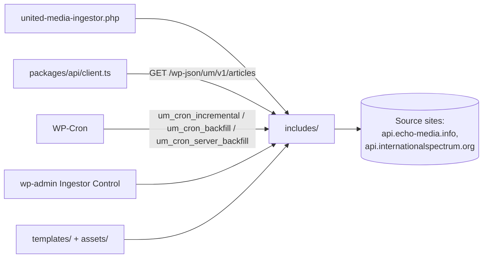

# united-media-ingestor — overview

WordPress plugin (v0.12.0) deployed to api.unitedmediadc.com that aggregates articles from two source WordPress sites (Echo Media, International Spectrum) into a local `um_article` store with a unified category taxonomy, and serves them to the UMG frontend via `GET /wp-json/um/v1/articles`. It also embeds UMG's headless config (CORS, REST no-cache, front-end 301 redirect), so no separate config plugin is needed for this site.

## Contents
| Item | Type | Summary |
|------|------|---------|
| [united-media-ingestor.php](united-media-ingestor.php.md) | file | Bootstrap: loads the 12 includes, headless config hooks, activation (cron scheduling + category term seeding) and a version-bump upgrade hook that re-seeds new terms |
| [includes/](includes/README.md) | folder | All plugin logic: config, HTTP, normalization, mapping, storage, backfill/incremental runners, cron, admin UI, REST, legacy search |
| [assets/](assets/README.md) | folder | Stylesheet for the legacy native-search results page |
| [templates/](templates/README.md) | folder | Search-results template override (legacy/debug-only behind the front-end redirect) |

## Connections

```mermaid
graph LR
  bootstrap[united-media-ingestor.php] --> includes[includes/]
  includes --> sources[(Source sites:<br/>api.echo-media.info,<br/>api.internationalspectrum.org)]
  frontend[packages/api/client.ts] -->|GET /wp-json/um/v1/articles| includes
  cron[WP-Cron] -->|um_cron_incremental / um_cron_backfill / um_cron_server_backfill| includes
  admin[wp-admin Ingestor Control] --> includes
  search[templates/ + assets/] --> includes
```

## Entry points
- **Plugin bootstrap:** [united-media-ingestor.php](united-media-ingestor.php.md) (activation seeds `um_category` terms and schedules cron; deactivation unschedules).
- **Public REST:** `GET /wp-json/um/v1/articles` (search/source/category/page/per_page/include_excluded/include_content) — public, no auth; consumed by [packages/api/client.ts](../../packages/api/client.ts.md).
- **Cron hooks:** `um_cron_incremental` (every 5 min — new posts), `um_cron_backfill` (every 15 min — archive continuation), `um_cron_server_backfill` (every minute while the admin-toggled option is active).
- **Admin:** UM Articles → Ingestor Control (`um-ingestor-control`) with manual/continuous/server backfill, incremental runs, source-category re-sync (blank slug = whole site, 500 posts/click), settings, image refresh, delete-by-source, and delete-all.

**Diplomatic Watch was dropped as a source** at the client's request (v0.12.0, 2026-10-01). It had been 92.4% of the store (2,597 of 2,811 articles), so the version removes it from `um_sites_config()` and strips its 25 `dw-*` categories, and adds a delete-by-source admin action so the ~214 Echo Media + International Spectrum articles survive the purge instead of being wiped by delete-all. Three parent buckets (`world-news-politics`, `economy-business`, `diplomacy`) are now childless but were kept for future refilling. As of this commit the plugin is **not yet deployed and the DW articles are not yet purged** — deploying only stops future ingestion.

Headless config for this backend (CORS whitelist for unitedmediadc.com origins, REST no-cache, 301 of non-`/wp-json` traffic) lives in the bootstrap — the equivalents for the other two sites are the standalone [../em-headless-config.php](../em-headless-config.php.md) and [../is-headless-config.php](../is-headless-config.php.md).

---
*Documented at commit 0c47b38.*
