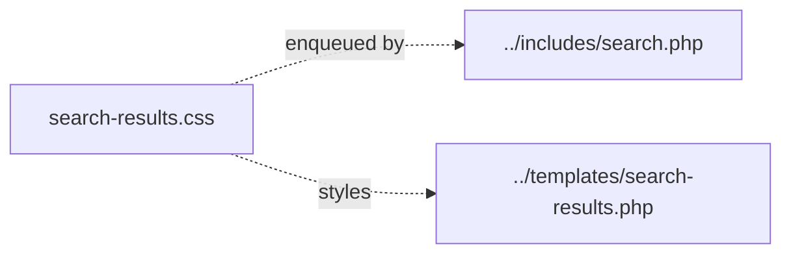

# united-media-ingestor/assets — overview

Static assets for the plugin's legacy WordPress-native search results page. One stylesheet, enqueued only on `is_search()` pages of the API backend.

## Contents
| Item | Type | Summary |
|------|------|---------|
| [search-results.css](search-results.css.md) | file | Card layout (thumbnail left, content right), search form, no-results block, responsive rules for the search template |

## Connections

## Entry points
No direct entry points — `um_enqueue_search_assets()` in [../includes/search.php](../includes/search.php.md) registers the stylesheet (handle `um-search-results`, URL from `UMI_URL`) when the markup from [../templates/search-results.php](../templates/search-results.php.md) renders. Effectively dormant in production because the bootstrap 301-redirects all non-`/wp-json` traffic.

---
*Documented at commit 1cbdce5.*
