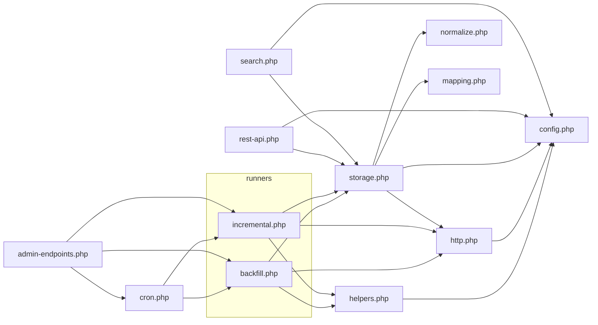

# united-media-ingestor/includes — overview

The twelve include files that implement the article aggregator: configuration, HTTP fetching from the three source sites, normalization and category mapping, CPT storage/upsert, the backfill + incremental runners, cron wiring, the wp-admin control panel, the public REST feed, and legacy native-search override. Loaded in dependency order by the plugin bootstrap.

## Contents
| Item | Type | Summary |
|------|------|---------|
| [config.php](config.php.md) | file | Source-site list, CORS origins, redirect URL, tuning constants (several option-backed), meta key names |
| [helpers.php](helpers.php.md) | file | Ingest lock, backfill state + incremental cursor options, autorun toggle, logging, upsert tallying |
| [http.php](http.php.md) | file | All outbound `wp_remote_get`: page/since/before/offset post fetches, media URL resolution, totals headers, 5xx retry |
| [normalize.php](normalize.php.md) | file | Pure extractors: categories from `_embed`, title/excerpt/date cleanup, gallery-shortcode IDs, content image URLs |
| [mapping.php](mapping.php.md) | file | Unified category model (8 parents, ~33 children), source-name→slug maps, exclusion rules, `um_resolve_categories` |
| [storage.php](storage.php.md) | file | `um_article` CPT + `um_category` taxonomy registration; `um_upsert_article` dedupe/insert/update with all meta |
| [backfill.php](backfill.php.md) | file | Resume-safe archive ingestion: batch mode with binary-search corrupt-article skipping, or single-article mode |
| [incremental.php](incremental.php.md) | file | Per-site "since cursor" pass picking up newly published posts |
| [cron.php](cron.php.md) | file | Custom intervals, 5-min incremental + 15-min backfill events, every-minute "server backfill" controls |
| [admin-endpoints.php](admin-endpoints.php.md) | file | Ingestor Control admin page, admin-post/AJAX handlers (runs, resets, settings, image refresh, delete-all), list-table columns |
| [rest-api.php](rest-api.php.md) | file | Public `GET /wp-json/um/v1/articles` — the feed the UMG frontend consumes |
| [search.php](search.php.md) | file | Legacy native-search override: custom template + title/excerpt/plaintext SQL search |

## Connections

## Entry points
- Loaded by [../united-media-ingestor.php](../united-media-ingestor.php.md) in order: config → helpers → http → normalize → mapping → storage → backfill → incremental → cron → admin-endpoints → rest-api → search.
- Public REST: `GET /wp-json/um/v1/articles` (rest-api.php) — consumed by [packages/api/client.ts](../../../packages/api/client.ts.md).
- Cron hooks: `um_cron_incremental` (5 min), `um_cron_backfill` (15 min), `um_cron_server_backfill` (1 min while active) — all defined in cron.php, scheduled from the bootstrap's activation hook.
- Admin: `edit.php?post_type=um_article&page=um-ingestor-control` plus the `admin_post_um_*` / `wp_ajax_um_*` handlers (admin-endpoints.php; duplicate legacy registrations in backfill.php/incremental.php).

---
*Documented at commit 1cbdce5.*
