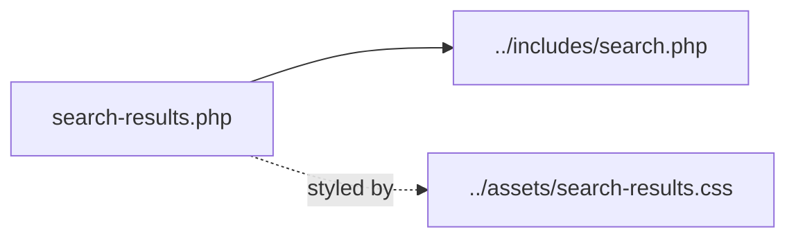

# united-media-ingestor/templates — overview

Theme-override templates. Currently a single search-results template that replaces Divi's search page with a list of ingested-article cards linking out to the original source sites.

## Contents
| Item | Type | Summary |
|------|------|---------|
| [search-results.php](search-results.php.md) | file | Renders all matching `um_article` posts (no pagination) as external-link cards; cleans Divi search params via redirect |

## Connections

## Entry points
Loaded via the `template_include` filter (`um_search_template_override`, priority `PHP_INT_MAX`) in [../includes/search.php](../includes/search.php.md) for non-empty `/?s=` searches. Legacy/debug-only in production — the bootstrap's front-end redirect prevents public access.

---
*Documented at commit 1cbdce5.*
